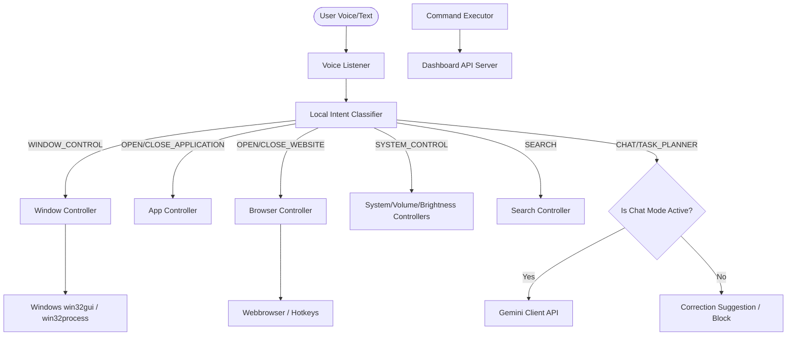

# AI Desktop Assistant

An intelligent, voice-controlled, and highly performant desktop assistant for Windows. It provides local system command automation, window management, web browser tab/navigation control, offline plugin handlers, and conversational chat/vision diagnostics powered by Google Gemini.

---

## 🚀 Key Features

* **Advanced Wake Word Redesign**:
  * **Mode 1**: Wake word only (*"Hey Buddy"* -> *"Yes, how can I help you?"*).
  * **Mode 2**: Combined sentence (*"Hey Buddy, open Chrome"*) for immediate command execution without second-turn latency.
* **Interruptible Asynchronous Speech**:
  * Uses native Windows SAPI5 for low-latency async voice generation.
  * Stop active speaking immediately by pressing the `Escape` key or saying voice triggers (*"stop"*, *"cancel"*, *"silence"*).
* **Robust Window Management**:
  * Tracks active handles (`HWND`, title, process ID) using `win32gui` / `win32process`.
  * Support for minimize, maximize, restore, close active, bring window to front, switch window, and show desktop.
* **Dedicated Browser Tab Controller**:
  * Focuses on tab control (open/close tabs, switch tabs, new tab, refresh, go back/forward, history, downloads).
  * Tab closures target the active page title specifically without restarting processes.
* **Offline Local Intent Classifier**:
  * Runs entirely offline using local pattern Matching and **RapidFuzz** string comparisons.
  * Strictly isolates educational/chat prompts from local automation tasks to preserve Gemini API quotas.
* **Performance diagnostics Dashboard**:
  * Lightweight HTTP background server serving a glassmorphic dark-themed diagnostic web UI at `http://localhost:8000`.
  * Renders real-time graphs for CPU, RAM, Disk, network speeds, and recently executed command logs.
* **Multimodal Vision & OCR**:
  * Screen capture and OCR extraction copied directly to the Windows clipboard via native `ctypes` bindings.
* **Dynamic Local Plugins**:
  * Weather, Music (YouTube / Spotify), Calculator, Notes, and Calendar events.

---

## 📊 System Architecture



---

## 📂 Repository Structure

```
AI-Agent/
│
├── README.md
├── LICENSE
├── requirements.txt
├── .env.example
├── .gitignore
├── main.py
│
├── ai/
│   ├── gemini_client.py
│   ├── intent_classifier.py
│   ├── context_manager.py
│   └── planner.py
│
├── controllers/
│   ├── app_controller.py
│   ├── browser_controller.py
│   ├── window_controller.py
│   └── process_manager.py
│
├── voice/
│   ├── listener.py
│   └── speaker.py
│
├── services/
│   ├── calendar_service.py
│   ├── email_service.py
│   ├── file_organizer_service.py
│   ├── scheduler_service.py
│   ├── screenshot_service.py
│   └── volume_service.py
│
├── plugins/
│   ├── base_plugin.py
│   ├── calculator.py
│   ├── calendar.py
│   ├── music.py
│   ├── notes.py
│   └── weather.py
│
├── utils/
│   ├── dashboard_server.py
│   ├── preferences_manager.py
│   ├── response_manager.py
│   ├── tray_indicator.py
│   └── logger.py
│
├── config/
│   ├── commands.json
│   ├── folders.json
│   └── custom_commands.json
│
└── dashboard/
    └── dashboard.html
```

---

## 🛠️ Installation Instructions

### Prerequisites
* **OS**: Windows 10/11
* **Python**: 3.10 to 3.13 (PyAudio requires PyAudio wheels on Windows)

### Steps

1. **Clone the Repository**:
   ```bash
   git clone https://github.com/Jnanendravarma/AI-Agent.git
   cd AI-Agent
   ```

2. **Setup Virtual Environment**:
   ```bash
   python -m venv venv
   venv\Scripts\activate
   ```

3. **Install Dependencies**:
   ```bash
   pip install -r requirements.txt
   ```

4. **Configure Environment Variables**:
   * Copy `.env.example` to `.env`:
     ```bash
     copy .env.example .env
     ```
   * Input your Gemini API key:
     ```env
     GEMINI_API_KEY=your_gemini_api_key
     ```

5. **Run the Assistant**:
   ```bash
   python main.py
   ```
   Open `http://localhost:8000` in your browser to view the Live Performance Dashboard!

---

## ⚠️ Known Limitations

1. **Windows Platform Bound**: Window handle checks and SAPI5 sound synthesis require standard win32 system calls (supported only on Microsoft Windows platforms).
2. **Audio Hardware Access**: PyAudio requires access to a working microphone device. Fallback to text terminal mode takes place automatically if no microphone is found.
3. **Active Tab Title Constraints**: `BrowserController.close_website()` closes matching sites only if the browser window is currently focused and its active tab title matches the website name.

---

## 📄 License

Distributed under the MIT License. See `LICENSE` for more information.
